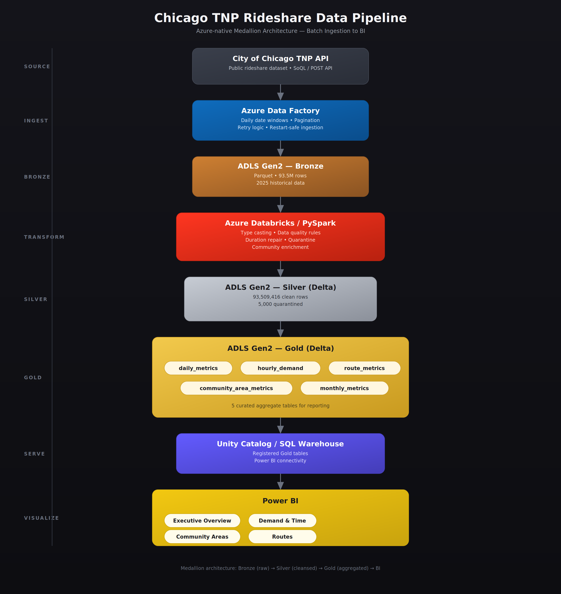
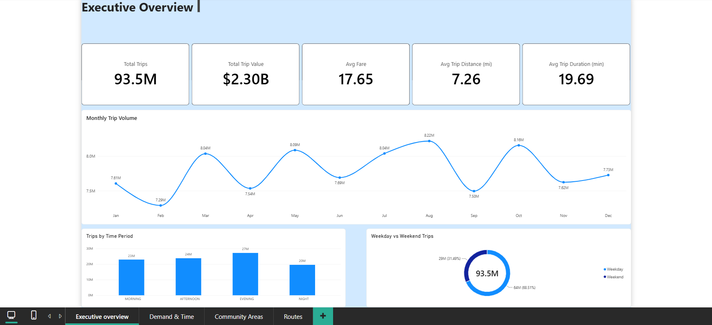
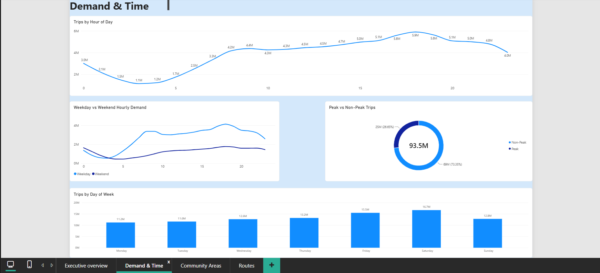
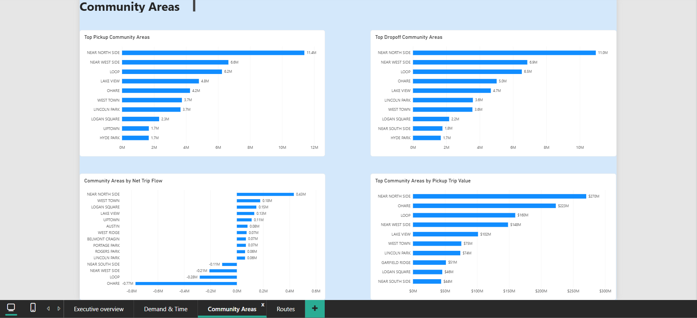
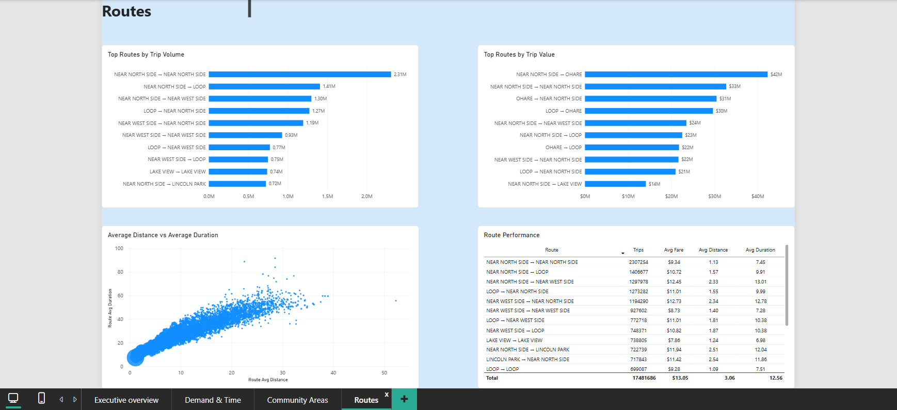

# Azure Databricks Rideshare Analytics Lakehouse

An end-to-end Azure data engineering project that ingests, validates, transforms, enriches, aggregates, and visualizes more than **93 million rideshare trips** using Azure Data Factory, ADLS Gen2, Azure Databricks, PySpark, Delta Lake, Unity Catalog, Databricks SQL Warehouse, and Power BI.

The project uses the **City of Chicago Transportation Network Providers (TNP) Trips public dataset** for 2025.

---

## Overview

This project demonstrates a production-style batch lakehouse architecture for processing high-volume rideshare data.

The pipeline:

1. Ingests public rideshare trip data through the City of Chicago API.
2. Stores raw data in an ADLS Gen2 Bronze layer.
3. Performs data-quality validation and transformation using Azure Databricks and PySpark.
4. Quarantines invalid records rather than silently dropping them.
5. Enriches trips with Chicago community-area information.
6. Creates analytical Gold marts for time, geography, routes, and business KPIs.
7. Registers Gold tables for SQL access.
8. Connects the curated Gold layer to Power BI for business reporting.

### Final Scale

```text
Bronze rows:       93,514,416
Silver rows:       93,509,416
Quarantined rows:       5,000
Calendar coverage:    365/365 days
```

---

## Business Problem

High-volume rideshare trip data becomes difficult to analyze efficiently when every reporting request operates directly on raw source records.

The project models a mobility analytics use case where analysts need reliable answers to questions such as:

- How does trip demand change by month, day, and hour?
- What time periods experience the highest demand?
- How does weekday demand differ from weekend demand?
- Which Chicago community areas generate the most pickups and dropoffs?
- Which areas have the largest pickup/dropoff imbalance?
- Which routes generate the highest trip volume and trip value?
- How do route distance and duration relate to each other?

The goal was to build a reusable lakehouse pipeline that separates ingestion, data-quality processing, analytical transformation, and reporting.

---

## Architecture



```text
City of Chicago TNP API
            |
            v
Azure Data Factory
POST + SoQL
Date-window ingestion
Pagination
Retry / restart logic
            |
            v
ADLS Gen2
BRONZE - Parquet
93,514,416 rows
            |
            v
Azure Databricks + PySpark
Schema enforcement
Data-quality validation
Duration repair
Quarantine
Community-area enrichment
Feature engineering
            |
            v
SILVER - Delta Lake
93,509,416 clean rows
5,000 quarantined rows
            |
            v
Databricks / PySpark
Business aggregations
            |
            v
GOLD - Delta Lake
5 analytical marts
            |
            v
Unity Catalog
Databricks SQL Warehouse
            |
            v
Power BI
4-page analytical dashboard
```

---

## Tech Stack

### Azure

- Azure Data Factory
- Azure Data Lake Storage Gen2
- Azure Databricks
- Azure Managed Identity / Access Connector

### Data Engineering

- PySpark
- Spark SQL
- Delta Lake
- Parquet
- Unity Catalog

### Analytics

- Databricks SQL Warehouse
- Power BI
- DAX

### Development

- Git
- GitHub

---

## Dataset

Source:

**City of Chicago Transportation Network Providers - Trips (2025-)**

Dataset ID:

```text
6dvr-xwnh
```

The dataset contains rideshare trip-level information including:

- trip ID
- trip start and end timestamps
- trip duration
- trip distance
- pickup and dropoff community-area IDs
- fare
- tips
- additional charges
- trip total
- pooled/shared-trip indicators
- geographic coordinates

The project uses public city transportation data and does not represent internal data from Uber, Lyft, or another private rideshare company.

---

# Pipeline Design

## Bronze Layer - Ingestion

Azure Data Factory is responsible for API ingestion and landing raw rideshare data into ADLS Gen2.

The final historical ingestion design uses:

```text
pl_2025_historical_backfill
        |
        v
pl_monthly_rideshare_ingestion
```

Despite the child pipeline's original name, the final implementation operates using parameterized **daily date windows**.

### API Strategy

Initial ingestion experiments used HTTP GET requests, but parameterized requests became difficult to manage for large historical volumes.

The final implementation uses:

```text
HTTP POST
+
SoQL query in request body
```

with filtering based on:

```text
trip_start_timestamp >= start_date
trip_start_timestamp < end_date
```

Pagination uses:

```text
pageSize = 50,000
```

and calculates the required number of pages dynamically using a source row-count query.

### Historical Backfill

The 2025 historical dataset was ingested using date-window slicing rather than deep month-level pagination.

ADF dynamically generates:

```text
p_year
p_month
p_day
p_start_date
p_end_date
```

for each daily window.

Controlled parent-pipeline concurrency allows multiple date windows to run while limiting excessive API pressure.

### Restart-Safe Ingestion

Before each page is copied, ADF checks whether the target Bronze file already exists.

```text
Get Metadata
      |
      v
If file missing
      |
      v
Copy activity
```

This allows failed ingestion runs to be restarted without unnecessarily re-copying pages that were already successfully written.

### Bronze Storage Layout

```text
lakehouse/
└── bronze/
    └── trips/
        └── year=2025/
            ├── month=01/
            ├── month=02/
            ├── ...
            └── month=12/
```

Bronze data is stored as compressed Parquet.

---

## Bronze Validation

Historical ingestion for 2025 produced:

```text
Total rows:             93,514,416
Total source columns:           21
Months represented:          12/12
Calendar dates:             365/365
Minimum date:            2025-01-01
Maximum date:            2025-12-31
Duplicate trip IDs:               0
```

### Initial Data-Quality Findings

Bronze profiling identified:

```text
Null trip_seconds:                  4,725
End timestamp before start:         4,476
Non-positive trip_seconds:            354
Negative trip_miles:                    0
Negative fare:                          0
Negative trip_total:                    0
```

Further analysis showed that:

```text
79
```

missing duration records could safely be reconstructed from valid start/end timestamps.

Exactly:

```text
5,000
```

duration/timestamp records were identified as unrecoverable and routed to quarantine during Silver processing.

---

# Silver Layer - Transformation & Data Quality

The Silver layer converts the raw Bronze dataset into a typed, validated, enriched, analytics-ready Delta dataset.

Implementation:

```text
databricks/silver/03_bronze_to_silver_trips.py
```

---

## Schema Standardization

Bronze values were explicitly converted into appropriate analytical datatypes including:

- timestamps
- integers
- long integers
- doubles
- decimals
- booleans
- dates

Validation confirmed:

```text
0 conversion failures
```

for the validated fields.

---

## Duration Repair

For records with invalid or missing trip duration, timestamp-derived duration was calculated.

The repair rule was:

```text
If trip end < trip start
    -> quarantine

Else if trip_seconds is null or non-positive
     and timestamp-derived duration > 0
    -> reconstruct duration

Else if duration remains zero/unrecoverable
    -> quarantine
```

Recoverable rows:

```text
79
```

These rows retain an explicit flag:

```text
trip_seconds_imputed = true
```

---

## Quarantine Design

Unrecoverable records are not silently deleted.

They are persisted separately for auditability.

Quarantine breakdown:

| Reason | Rows |
|---|---:|
| `TRIP_END_BEFORE_TRIP_START` | 4,476 |
| `ZERO_OR_UNRECOVERABLE_DURATION` | 524 |
| **Total** | **5,000** |

Storage:

```text
lakehouse/silver/quarantine/trips/
```

---

## Community Area Enrichment

Trips are enriched using the official Chicago Community Areas reference dataset containing:

```text
77 community areas
```

The small reference dataset is broadcast-joined twice:

```text
pickup_community_area
        ->
pickup_community_name
```

and:

```text
dropoff_community_area
        ->
dropoff_community_name
```

Validation showed:

```text
Unmatched non-null pickup IDs:   0
Unmatched non-null dropoff IDs:  0
```

Trips where the source does not provide a community-area ID are retained and represented as:

```text
UNKNOWN
```

instead of being removed.

---

## Analytical Features

Silver adds derived attributes including:

- `trip_duration_minutes`
- `fare_per_mile`
- `avg_speed_mph`
- `trip_date`
- `trip_hour`
- `trip_day_of_week`
- `trip_month`
- `is_weekend`
- `time_period`
- `is_peak_hour`
- `distance_category`
- `trip_seconds_imputed`
- pickup geography quality flag
- dropoff geography quality flag
- financial-data quality flag

The final Silver schema contains:

```text
40 columns
```

---

## Silver Row Reconciliation

```text
Bronze:       93,514,416
Silver:       93,509,416
Quarantine:        5,000
```

Validation:

```text
93,509,416
+    5,000
------------
93,514,416
```

There is no unexplained row loss.

---

## Final Silver Validation

```text
Total Silver rows:                93,509,416
Null trip IDs:                             0
Imputed duration rows:                    79
Invalid trip_seconds remaining:            0
Reversed timestamps remaining:             0
Unknown pickup community:         16,577,458
Unknown dropoff community:        17,739,136
Missing financial-data rows:         409,138
```

---

## Delta Lake Output

Silver is persisted as Delta Lake:

```text
lakehouse/silver/trips/
```

Partition column:

```text
trip_month
```

Persisted Delta metadata:

```text
Format:           delta
Partition column: trip_month
Number of files:  24
```

---

# Gold Layer - Analytical Marts

The Gold layer converts the clean Silver dataset into business-oriented analytical datasets.

Implementation:

```text
databricks/gold/04_silver_to_gold.py
```

Five Gold marts were created.

| Gold Mart | Persisted Rows | Purpose |
|---|---:|---|
| `daily_metrics` | 365 | Daily demand and KPI trends |
| `hourly_demand` | 8,759 | Hourly demand and peak-period analysis |
| `community_area_metrics` | 28,470 | Pickup/dropoff and community-area analysis |
| `route_metrics` | 71,063 | Origin-destination route analysis |
| `monthly_metrics` | 12 | Monthly executive reporting |

---

## Gold Reconciliation

Every Gold mart was independently reconciled back to the Silver population.

```text
daily_metrics:       93,509,416
hourly_demand:       93,509,416
community_pickup:    93,509,416
community_dropoff:   93,509,416
route_metrics:       93,509,416
monthly_metrics:     93,509,416
```

This confirms that the Gold aggregations represent the complete clean Silver population.

---

## Gold Table Registration

The five Gold tables were registered under:

```text
adb_chicago_rideshare.gold
```

Registered tables:

```text
community_area_metrics
daily_metrics
hourly_demand
monthly_metrics
route_metrics
```

These tables are exposed through a Databricks SQL Warehouse for reporting.

---

# Power BI Dashboard

The Gold marts are consumed in Power BI through Databricks SQL.

The final report contains four analytical pages.

---

## 1. Executive Overview



Key KPIs include:

```text
Total Trips:          93.5M
Total Trip Value:     $2.30B
Average Fare:         $17.65
Average Distance:     7.26 miles
Average Duration:     19.69 minutes
```

The page also provides:

- monthly trip trends
- demand by time period
- weekday vs weekend trip share

---

## 2. Demand & Time



This page analyzes:

- demand by hour of day
- weekday vs weekend hourly patterns
- peak vs non-peak trip share
- demand by day of week

---

## 3. Community Areas



Community-level analysis includes:

- top pickup areas
- top dropoff areas
- community areas by net trip flow
- community areas by pickup trip value

Records with missing source geography are excluded from ranked location comparisons but remain preserved in the underlying Silver dataset.

---

## 4. Routes



Route analysis includes:

- top routes by trip volume
- top routes by trip value
- average distance vs average duration
- route performance metrics

Routes containing unknown source geography are excluded from ranked route analysis.

Trip-weighted Power BI measures are used for route-level averages to avoid incorrectly summing pre-aggregated monthly averages.

---

# Key Engineering Challenges

## 1. API Request Failures

Parameterized GET-based requests initially returned HTTP 400 errors.

The ingestion design was changed to:

```text
POST + SoQL request body
```

which provided better control over filtering and pagination.

---

## 2. Deep Pagination Performance

Month-level pagination resulted in large page counts and very long historical runs.

The ingestion architecture was redesigned around:

```text
daily date windows
+
controlled parallelism
```

which reduced the depth of each individual API query.

---

## 3. API and ADF Timeouts

Some API requests exceeded the default Web Activity timeout.

The pipeline was updated with:

```text
10-minute request timeout
2 retries
120-second retry interval
```

---

## 4. Restarting Failed Historical Loads

Long-running backfills may partially succeed before an individual request fails.

A restart-safe design was introduced using:

```text
Get Metadata
        |
        v
Check file existence
        |
        v
Copy only missing files
```

This prevents already-ingested pages from being unnecessarily downloaded again.

---

## 5. Incorrectly Parameterized Copy Request

During historical validation, folders and filenames appeared to represent different months, but validation showed that all copied records were still January data.

The issue was traced to a hard-coded January filter inside the Copy Activity request body.

This was corrected by injecting:

```text
p_start_date
p_end_date
```

directly into the SoQL body.

A two-day February smoke test was then performed before the full historical backfill was rerun.

This issue reinforced the importance of validating the **contents of data**, rather than relying only on successful pipeline status or output filenames.

---

## 6. Invalid Duration Records

Some source records contained:

- reversed timestamps
- null duration
- zero duration

Rather than applying a blanket correction, records were classified according to recoverability.

This resulted in:

```text
79 repaired records
5,000 quarantined records
```

with explicit auditability.

---

# Validation Evidence

ADF pipeline and Databricks validation evidence is available under:

```text
docs/screenshots/adf/
docs/screenshots/databricks/
```

Databricks validation evidence includes:

- Bronze 12-month validation
- Silver final validation
- Silver quarantine distribution
- Silver Delta validation
- Gold persisted table counts
- Gold reconciliation
- Gold registered tables

Additional implementation and troubleshooting details are documented in:

```text
docs/troubleshooting.md
```

---

# Repository Structure

```text
azure-databricks-rideshare-lakehouse/
│
├── README.md
├── .gitignore
│
├── architecture/
│   └── rideshare_lakehouse_architecture.png
│
├── adf/
│   ├── datasets/
│   │   └── chicago_raw_sink.json
│   │
│   └── pipelines/
│       ├── Chicago2DL.json
│       ├── pl_2025_historical_backfill.json
│       └── pl_monthly_rideshare_ingestion.json
│
├── databricks/
│   ├── bronze/
│   │   ├── 01_validate_january_bronze.py
│   │   └── 02_validate_full_bronze.py
│   │
│   ├── silver/
│   │   └── 03_bronze_to_silver_trips.py
│   │
│   └── gold/
│       └── 04_silver_to_gold.py
│
├── reference-data/
│   └── community_areas.csv
│
├── powerbi/
│   ├── Chicago_Rideshare_Analytics.pbix
│   └── screenshots/
│       ├── 01_executive_overview.png
│       ├── 02_demand_and_time.png
│       ├── 03_community_areas.png
│       └── 04_routes.png
│
└── docs/
    ├── troubleshooting.md
    └── screenshots/
        ├── adf/
        └── databricks/
```

`Chicago2DL.json` represents the initial January ingestion implementation.

The final historical backfill architecture uses:

```text
pl_2025_historical_backfill.json
+
pl_monthly_rideshare_ingestion.json
```

---

# Data Quality Principles

### Do Not Silently Drop Invalid Data

Invalid duration records are quarantined and remain available for investigation.

### Repair Only When the Source Provides Enough Evidence

Missing duration is reconstructed only when valid timestamps allow the value to be derived confidently.

### Preserve Incomplete but Usable Trips

Trips with missing community-area or financial attributes are retained with explicit quality flags.

### Validate Row Reconciliation Between Layers

Bronze, Silver, quarantine, and Gold datasets are reconciled to identify unexpected data loss.

### Validate Data Contents, Not Only Pipeline Execution

Successful orchestration does not guarantee correct business data.

Content-level validation was used to catch an incorrectly parameterized historical ingestion request.

---

# Key Results

```text
93,514,416 Bronze records
93,509,416 validated Silver records
5,000 quarantined records
79 repaired duration records
0 duplicate trip IDs
365/365 calendar days represented
77 Chicago community areas enriched
5 Gold analytical marts
4 Power BI dashboard pages
```

Gold aggregation reconciliation:

```text
100% of clean Silver trips represented
```

---

# Project Status

- ✅ Azure Data Factory ingestion — Completed
- ✅ Bronze layer — Completed and validated
- ✅ Silver layer — Completed and validated
- ✅ Gold layer — Completed and validated
- ✅ Delta Lake persistence — Completed
- ✅ Gold table registration — Completed
- ✅ Databricks SQL integration — Completed
- ✅ Power BI dashboard — Completed
- ✅ End-to-end project — Completed

---

# Lessons Learned

This project reinforced several practical data-engineering lessons:

- API ingestion strategies that work for small samples may not scale to tens of millions of rows.
- Date-window slicing can be more reliable than deep pagination for historical API ingestion.
- Retry logic alone is not enough; long-running pipelines should also be restart-safe.
- Successful pipeline execution does not guarantee correct data.
- Row-count and business-rule validation should exist between every lakehouse layer.
- Invalid records should be quarantined when they cannot be safely repaired.
- Small reference datasets are strong candidates for Spark broadcast joins.
- Analytical marts should be designed around downstream consumption rather than exposing raw Silver data directly.
- Pre-aggregated averages must be handled carefully in BI tools; weighted measures are often required when aggregating across periods.

---

## Final Outcome

The result is a complete Azure lakehouse project covering:

```text
API ingestion
→ orchestration
→ cloud storage
→ distributed transformation
→ data-quality management
→ Delta Lake
→ analytical marts
→ SQL serving
→ Power BI reporting
```

The project demonstrates both the implementation of a modern Azure/Databricks data platform and the validation and troubleshooting decisions required to make the resulting data trustworthy.
